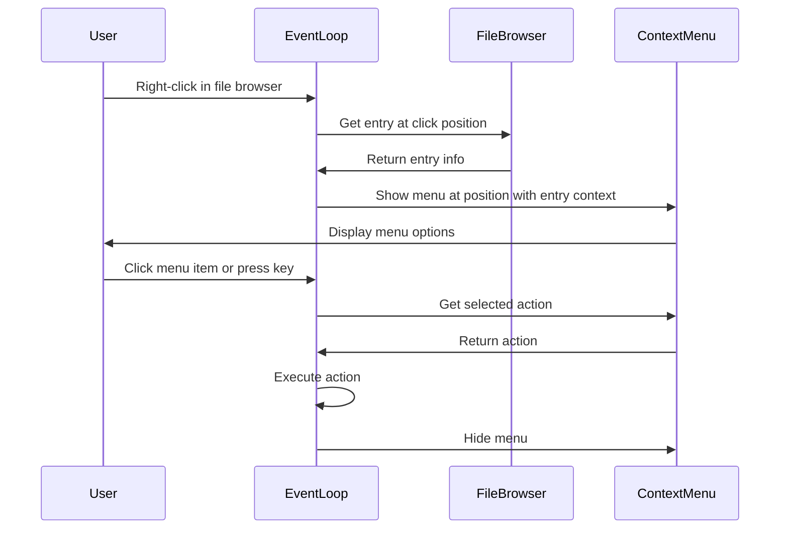

# File Browser Context Menu Implementation Plan

## Overview
Add a right-click context menu to the file browser that displays common file operations like "Open in Terminal", "Copy Path", "Rename", "Delete", etc.

## Architecture

### Components

1. **ContextMenu Widget** - New widget in `uterx-ui/src/widgets/`
   - Displays a floating menu at the mouse position
   - Shows context-sensitive options based on the clicked entry type
   - Supports keyboard navigation (arrows, Enter, Escape)

2. **FileBrowserState Extensions** - Add context menu state
   - Track whether context menu is visible
   - Store the position and selected entry for the context menu
   - Track which menu item is highlighted

3. **Event Loop Integration** - Handle right-click events
   - Detect right-click in file browser area
   - Show context menu at click position
   - Handle menu item selection

### Context Menu Options

#### For Directories:
- **Open in Terminal** - Open a new terminal pane cd'd to this directory
- **Open in New Tab** - Open a new tab with this directory as cwd
- **Copy Path** - Copy the full path to clipboard
- **Copy Relative Path** - Copy the path relative to root
- **Rename** - Rename the directory
- **Delete** - Delete the directory
- **Refresh** - Refresh the directory contents

#### For Files:
- **Open in Editor** - Open file in the configured $EDITOR
- **Open in Terminal** - Open terminal in the file's parent directory
- **Copy Path** - Copy the full path to clipboard
- **Copy Relative Path** - Copy the path relative to root
- **Rename** - Rename the file
- **Delete** - Delete the file

#### For ".." (parent directory):
- **Navigate Up** - Go to parent directory

### Data Structures

```rust
/// Context menu entry
pub struct ContextMenuItem {
    pub label: String,
    pub action: ContextMenuAction,
    pub enabled: bool,
}

/// Actions available from context menu
pub enum ContextMenuAction {
    OpenInTerminal,
    OpenInNewTab,
    OpenInEditor,
    CopyPath,
    CopyRelativePath,
    Rename,
    Delete,
    Refresh,
    NavigateUp,
}

/// Context menu state
pub struct ContextMenuState {
    pub visible: bool,
    pub x: u16,
    pub y: u16,
    pub items: Vec<ContextMenuItem>,
    pub selected: usize,
    pub target_path: Option<PathBuf>,
    pub target_is_dir: bool,
}
```

### Event Flow



## Implementation Steps

### Step 1: Create Context Menu Widget
Create `crates/uterx-ui/src/widgets/context_menu.rs`:
- Define `ContextMenuItem`, `ContextMenuAction`, `ContextMenuState`
- Implement `ContextMenuWidget` with ratatui `Widget` trait
- Style with Catppuccin theme to match existing UI

### Step 2: Update FileBrowserState
Modify `crates/uterx-ui/src/widgets/file_browser.rs`:
- Add `context_menu: ContextMenuState` field
- Add methods: `show_context_menu()`, `hide_context_menu()`, `context_menu_up()`, `context_menu_down()`

### Step 3: Update widgets.rs
Export the new context menu types from `crates/uterx-ui/src/widgets.rs`

### Step 4: Handle Right-Click in Event Loop
Modify `crates/uterx-app/src/event_loop.rs`:
- Add `MouseEventKind::Down(MouseButton::Right)` handling
- Show context menu when right-clicking in file browser area
- Handle context menu keyboard navigation
- Execute actions when menu item is selected

### Step 5: Implement Actions
Add action handlers in event_loop.rs:
- `execute_context_menu_action()` function
- Integration with existing terminal/session management
- Clipboard operations (may need to add clipboard dependency)

## Technical Considerations

### Mouse Position Handling
- Context menu should appear at mouse cursor position
- Menu should not extend beyond terminal boundaries
- Menu width should auto-size to content

### Keyboard Navigation
- Arrow Up/Down: Navigate menu items
- Enter: Select item
- Escape: Close menu
- First letter: Jump to item starting with that letter

### Focus Management
- When context menu is open, keyboard focus goes to menu
- Clicking outside menu closes it
- Clicking on menu item executes action and closes menu

### Styling
- Use Catppuccin color scheme
- Selected item highlighted with surface1 background
- Disabled items shown in overlay0 color
- Icons for common actions

## Files to Modify

1. **New file**: `crates/uterx-ui/src/widgets/context_menu.rs`
2. **Modify**: `crates/uterx-ui/src/widgets/file_browser.rs`
3. **Modify**: `crates/uterx-ui/src/widgets.rs`
4. **Modify**: `crates/uterx-app/src/event_loop.rs`

## Dependencies
- May need to add `clipboard` crate for copy path functionality
- No other new dependencies required
