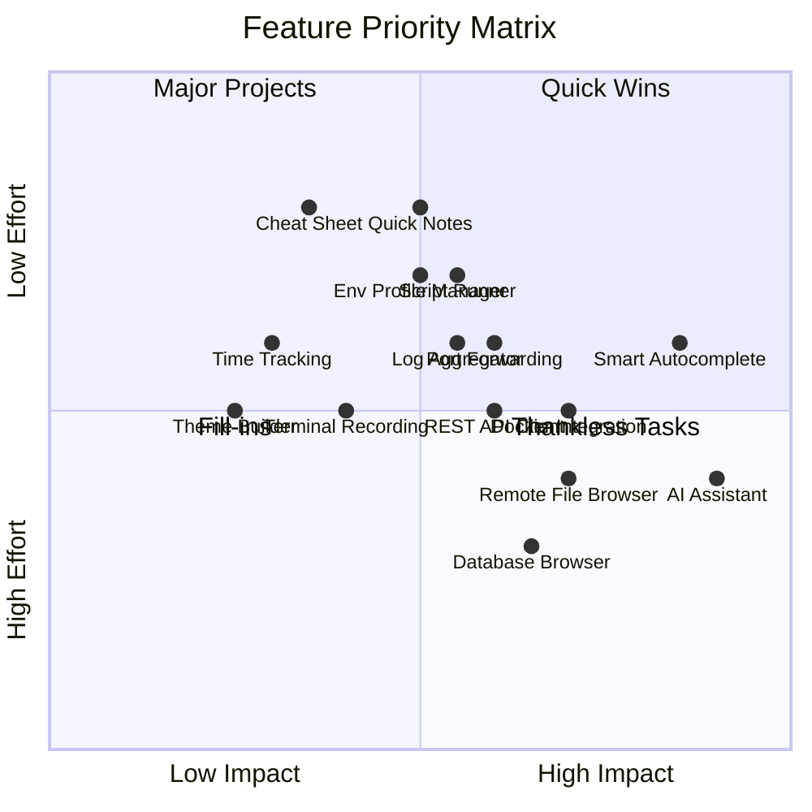

# Phase 8 — Innovative Feature Extensions

## Overview

This document proposes additional features for uterx that go beyond the already planned Phase 7 features. These proposals focus on enhancing the "Terminal Desktop" experience, improving developer productivity, and leveraging the existing plugin architecture.

## Current Status Summary

| Phase | Status | Focus |
|-------|--------|-------|
| Phase 1 | ~95% | Core Terminal (VTE, Grid, Parser) |
| Phase 2 | ~85% | Multiplexer (Panes, Tabs, Sessions) |
| Phase 3 | ~20% | GPU Rendering (wgpu, Atlas, Shaders) |
| Phase 4 | ~30% | Plugin System (WASM, Host APIs) |
| Phase 5 | Started | Example Plugins |
| Phase 6 | Planned | Polish & Release |
| Phase 7 | Planned | 10 Innovative Features |

---

## Proposed New Features

### 1. AI Assistant Integration

**Description**: Built-in AI assistant pane for command suggestions, debugging help, and code explanations.

**Use Cases**:
- Ask "How do I find large files?" → AI suggests `du -h --max-depth=1 | sort -hr`
- Highlight error output → AI explains the error and suggests fixes
- Natural language to command translation

**Integration**:
- New dedicated AI pane as primary UX in `uterx-ui`/mux
- Plugin-first backend (`UterxAI`) with provider adapters
- Multi-provider target set: Claude, Gemini, OpenAI/ChatGPT, xAI, Z.ai, Moonshot, Minimax
- Context injection (opt-in): current directory, recent commands, pane content

**Technical Components**:
```
uterx-ai/
├── provider.rs      # Trait for AI providers
├── openai.rs        # OpenAI API client
├── ollama.rs        # Local Ollama integration
├── context.rs       # Context building from terminal state
└── widget.rs        # Ratatui AI chat widget
```

**Performance**: Streaming responses required in v1, async transport where possible

**Priority**: High — Differentiator from other terminals

---

### 2. Smart Command Autocomplete

**Description**: Context-aware command suggestions based on history, current directory, and man pages.

**Use Cases**:
- Type `git` → Shows recent git commands used in this repo
- Type `docker` → Shows available containers and common operations
- Fuzzy search through command history with preview

**Integration**:
- Extends existing `InputHandler`
- New `AutocompleteOverlay` widget
- History database with context metadata (directory, exit code, timestamp)

**Technical Components**:
```
uterx-core/
├── history.rs       # Enhanced history with metadata
├── suggest.rs       # Suggestion engine
└── man_parser.rs    # Man page extraction for options
```

**Performance**: SQLite for history storage, background indexing

**Priority**: High — Major productivity boost

---

### 3. Container/Docker Integration

**Description**: Visual Docker container management with one-click shell access.

**Use Cases**:
- List running containers with status indicators
- Click container → Opens shell in container
- View logs, stats, and resource usage
- Start/stop/restart containers from UI

**Integration**:
- New `DockerWidget` in sidebar or floating pane
- Docker CLI wrapper for cross-platform support
- Container shell via `docker exec -it`

**Technical Components**:
```
uterx-docker/
├── client.rs        # Docker CLI wrapper
├── container.rs     # Container data structures
├── stats.rs         # Resource monitoring
└── widget.rs        # Ratatui container list widget
```

**Performance**: Polling-based updates (configurable interval)

**Priority**: Medium — Great for DevOps workflows

---

### 4. REST API Client

**Description**: Built-in HTTP client for API testing, similar to Postman but terminal-native.

**Use Cases**:
- Save and organize API requests
- Environment variables for different APIs (dev/staging/prod)
- Response highlighting and formatting
- Request history with replay

**Integration**:
- New `ApiClientWidget` as floating pane
- Integration with file browser for request collections
- Syntax highlighting for JSON/XML responses

**Technical Components**:
```
uterx-http/
├── client.rs        # Async HTTP client
├── collection.rs    # Request collection management
├── environment.rs   # Environment variable sets
└── widget.rs        # Ratatui API client UI
```

**Performance**: Async requests, response caching

**Priority**: Medium — Useful for backend developers

---

### 5. Database Browser

**Description**: Connect to databases, browse tables, and run queries directly in uterx.

**Use Cases**:
- Quick table inspection without leaving terminal
- Run ad-hoc SQL queries
- View table schema and relationships
- Export query results to CSV/JSON

**Integration**:
- Plugin-based database drivers (SQLite, PostgreSQL, MySQL, Redis)
- New `DatabaseWidget` with query editor
- Results displayed in tabular format

**Technical Components**:
```
uterx-db/
├── connection.rs    # Connection management
├── drivers/
│   ├── sqlite.rs
│   ├── postgres.rs
│   └── mysql.rs
├── query.rs         # Query execution
└── widget.rs        # Ratatui database browser
```

**Performance**: Connection pooling, async queries, result pagination

**Priority**: Medium — Great for backend/full-stack developers

---

### 6. Terminal Recording & Playback

**Description**: Record terminal sessions for documentation, tutorials, or debugging.

**Use Cases**:
- Record bug reproduction steps
- Create animated GIF demos
- Playback recorded sessions for review
- Export to asciinema format

**Integration**:
- Recording state in `Session`
- New `RecordingWidget` for playback controls
- Export functionality via plugin

**Technical Components**:
```
uterx-record/
├── recorder.rs      # Session recording logic
├── player.rs        # Playback engine
├── export.rs        # Export to asciinema/GIF
└── widget.rs        # Playback controls widget
```

**Performance**: Event-based recording (not frame-based), compression

**Priority**: Low — Nice to have for content creators

---

### 7. Quick Notes/Scratchpad

**Description**: Floating note panes that persist across sessions.

**Use Cases**:
- Quick notes without leaving terminal
- Copy-paste buffer for commands
- Markdown support for formatted notes
- Notes linked to directories/projects

**Integration**:
- New `NotesWidget` as floating pane
- Storage in `~/.uterx/notes/`
- Markdown rendering with syntect

**Technical Components**:
```
uterx-notes/
├── storage.rs       # Note persistence
├── markdown.rs      # Markdown rendering
└── widget.rs        # Ratatui notes widget
```

**Performance**: File-based storage, lazy loading

**Priority**: Medium — Simple but highly useful

---

### 8. Port Forwarding Manager

**Description**: Visual management of SSH tunnels and port forwards.

**Use Cases**:
- List active port forwards
- Create new tunnels with form UI
- Quick connect to common tunnels
- Tunnel templates for different environments

**Integration**:
- New `TunnelWidget` in sidebar
- SSH integration via `uterx-platform`
- Template storage in config

**Technical Components**:
```
uterx-tunnel/
├── manager.rs       # Tunnel lifecycle management
├── ssh.rs           # SSH tunnel creation
├── templates.rs     # Tunnel templates
└── widget.rs        # Ratatui tunnel manager
```

**Performance**: Background tunnel processes, status polling

**Priority**: Medium — Essential for remote development

---

### 9. Log Aggregator

**Description**: Tail multiple log files simultaneously with filtering and highlighting.

**Use Cases**:
- Watch multiple log files in one pane
- Filter by log level (ERROR, WARN, INFO)
- Highlight patterns with regex
- Timestamp correlation across files

**Integration**:
- New `LogAggregatorWidget`
- File watcher for log files
- Regex-based filtering

**Technical Components**:
```
uterx-logs/
├── watcher.rs       # Multi-file watcher
├── filter.rs        # Log filtering engine
├── highlight.rs     # Pattern highlighting
└── widget.rs        # Ratatui log viewer
```

**Performance**: Line buffering, async file watching

**Priority**: Medium — Great for debugging

---

### 10. Environment Profile Manager

**Description**: Visual environment variable management with profiles for different projects.

**Use Cases**:
- Switch between dev/staging/prod environments
- Visual editor for environment variables
- Auto-load profiles based on directory
- Import/export .env files

**Integration**:
- New `EnvProfileWidget`
- Profile storage in `~/.uterx/profiles/`
- Directory-based profile activation

**Technical Components**:
```
uterx-env/
├── profile.rs       # Profile management
├── loader.rs        # Profile loading/switching
├── envfile.rs       # .env file parsing
└── widget.rs        # Ratatui profile manager
```

**Performance**: In-memory profile cache

**Priority**: Medium — Simplifies environment management

---

### 11. Remote File Browser

**Description**: SFTP/SSH file browser for remote servers.

**Use Cases**:
- Browse remote files without mounting
- Edit remote files in built-in editor
- Drag-and-drop file transfer
- Server favorites with quick connect

**Integration**:
- Extends `FileBrowserWidget` for remote mode
- SSH/SFTP via `uterx-platform`
- Remote file caching

**Technical Components**:
```
uterx-remote/
├── sftp.rs          # SFTP client
├── cache.rs         # Remote file cache
├── transfer.rs      # File transfer progress
└── widget.rs        # Remote file browser widget
```

**Performance**: Lazy loading, background transfers

**Priority**: Medium — Essential for remote work

---

### 12. Cheat Sheet Integration

**Description**: Quick access to command cheat sheets (tldr-style).

**Use Cases**:
- Type `tldr tar` → Shows common tar examples
- Fuzzy search through cheat sheets
- Custom cheat sheets for team commands
- Integration with command palette

**Integration**:
- New `CheatSheetWidget`
- Local cache of tldr pages
- Custom cheat sheet storage

**Technical Components**:
```
uterx-cheatsheet/
├── cache.rs         # Local cheat sheet cache
├── parser.rs        # Markdown parsing
├── custom.rs        # Custom cheat sheets
└── widget.rs        # Ratatui cheat sheet viewer
```

**Performance**: Local cache, background updates

**Priority**: Low — Available via tldr command anyway

---

### 13. Time Tracking

**Description**: Track time spent in different projects/directories.

**Use Cases**:
- Automatic time tracking per directory
- Manual time entries
- Export timesheets
- Project summaries

**Integration**:
- Background tracking in `Session`
- New `TimeTrackingWidget`
- SQLite storage for entries

**Technical Components**:
```
uterx-time/
├── tracker.rs       # Automatic tracking
├── storage.rs       # Time entry storage
├── export.rs        # Timesheet export
└── widget.rs        # Ratatui time tracker
```

**Performance**: Background tracking, minimal overhead

**Priority**: Low — Niche use case

---

### 14. Custom Theme Builder

**Description**: Visual theme customization with live preview.

**Use Cases**:
- Create custom Catppuccin variants
- Import/export themes
- Live preview while editing
- Per-project themes

**Integration**:
- New `ThemeBuilderWidget`
- Theme storage in config
- Hot-reload theme changes

**Technical Components**:
```
uterx-theme/
├── builder.rs       # Theme construction
├── preview.rs       # Live preview rendering
├── export.rs        # Theme export/import
└── widget.rs        # Ratatui theme builder
```

**Performance**: Real-time preview updates

**Priority**: Low — Nice to have

---

### 15. Script Runner

**Description**: Organize and run frequently used scripts with parameter UI.

**Use Cases**:
- Define scripts in config with descriptions
- Parameter input UI for scripts
- Run history and output viewing
- Script categories and search

**Integration**:
- New `ScriptRunnerWidget`
- Script definitions in TOML config
- Output capture in panes

**Technical Components**:
```
uterx-scripts/
├── registry.rs      # Script registry
├── runner.rs        # Script execution
├── params.rs        # Parameter parsing
└── widget.rs        # Ratatui script runner
```

**Performance**: Async script execution

**Priority**: Medium — Great for automation

---

## Priority Matrix



---

## Top 5 Recommendations

Based on impact, effort, and alignment with uterx's "Terminal Desktop" vision:

### 1. AI Assistant Integration
- **Impact**: High — Major differentiator
- **Effort**: Medium — Plugin architecture ready
- **Why**: No other terminal has this built-in natively

### 2. Smart Command Autocomplete
- **Impact**: High — Daily productivity boost
- **Effort**: Medium — History system exists
- **Why**: Faster command entry, fewer errors

### 3. Docker/Container Integration
- **Impact**: High — Essential for modern dev
- **Effort**: Medium — Docker CLI wrapper
- **Why**: Container management is painful in terminals

### 4. Quick Notes/Scratchpad
- **Impact**: Medium — Simple but useful
- **Effort**: Low — Basic widget + storage
- **Why**: Quick wins, high user satisfaction

### 5. Remote File Browser
- **Impact**: High — Remote work essential
- **Effort**: Medium — SFTP client integration
- **Why**: Seamless remote development

---

## Implementation Phases

### Phase 8.1: Quick Wins
- AI Assistant Integration (UterxAI v1 kickoff)
- Quick Notes/Scratchpad
- Script Runner
- Environment Profile Manager

### Phase 8.2: Core Productivity
- Smart Command Autocomplete
- Docker Integration
- Log Aggregator

### Phase 8.3: Advanced Features
- Database Browser
- REST API Client

### Phase 8.4: Remote & Collaboration
- Remote File Browser
- Port Forwarding Manager
- Terminal Recording

---

## Technical Architecture

Each feature should follow the established pattern:

```
uterx-<feature>/
├── lib.rs           # Public API
├── core.rs          # Core logic (no UI)
├── widget.rs        # Ratatui widget
└── config.rs        # Feature configuration
```

Integration points:
- **Config**: Add feature sections to `AppConfig`
- **UI**: Register widgets in `event_loop.rs`
- **Commands**: Add to `CommandPalette`
- **Help**: Update `HelpOverlay`

---

## Questions for Discussion

1. AI Assistant implementation model fixed for v1: plugin-first (`UterxAI`), dedicated AI pane, streaming mandatory.
2. Which database drivers are most important (SQLite, PostgreSQL, MySQL)?
3. Should Docker integration support podman/nerdctl?
4. Priority of remote file browser vs. local features?
5. Any features not listed that would be valuable?
