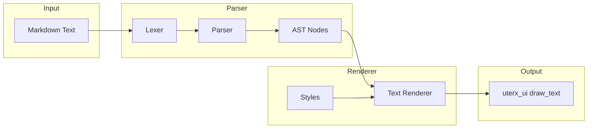
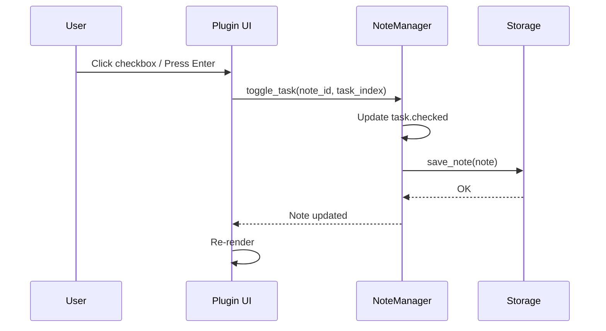

# Quick Notes Plugin — Implementation Plan

## Overview

Quick Notes ist ein WASM-Plugin für uterx, das schwebende Notiz-Fenster bereitstellt, die über Sessions hinweg persistieren. Es nutzt die bestehende Plugin-Architektur und Host-APIs.

## Architektur

```mermaid
flowchart TB
    subgraph uterx-app
        EL[event_loop.rs]
        PL[Plugin Manager]
    end
    
    subgraph uterx-plugin
        RT[Runtime / WASM]
        HA[Host API]
    end
    
    subgraph quick-notes plugin
        WASM[quick-notes.wasm]
        ST[Storage via fs API]
    end
    
    EL --> PL
    PL --> RT
    RT --> HA
    HA --> WASM
    WASM --> ST
    ST --> ~/.uterx/plugins/quick-notes/notes/
```

## Plugin Manifest

```toml
# plugin.toml
name = "quick-notes"
version = "0.1.0"
description = "Floating note panes that persist across sessions"
author = "uterx"
wasm_module = "quick-notes.wasm"
permissions = ["ui", "io", "filesystem"]
entry_point = "_start"
```

## Host API Requirements

Das Plugin benötigt folgende Host APIs (bereits implementiert in `uterx-plugin/src/runtime.rs`):

### uterx_ui
- `create_overlay(title_ptr, title_len)` → `pane_id: i64` — Erstellt ein schwebendes Pane
- `draw_text(pane_id, x, y, text_ptr, text_len)` — Zeichnet Text im Pane
- `get_size(pane_id)` → `(width, height)` — Gibt Pane-Größe zurück

### uterx_fs
- `read_file(path_ptr, path_len, buf_ptr, buf_len)` → `bytes_read: i32` — Liest Datei aus Sandbox
- `write_file(path_ptr, path_len, data_ptr, data_len)` → `success: i32` — Schreibt Datei in Sandbox

### uterx_io
- `read(stream_id, buf_ptr, buf_len)` → `bytes_read: i32` — Liest Keyboard-Input
- `write(stream_id, buf_ptr, buf_len)` → `bytes_written: i32` — Schreibt Output

## Plugin Structure

```
plugins/
└── quick-notes/
    ├── plugin.toml
    ├── Cargo.toml
    └── src/
        ├── lib.rs           # Entry point
        ├── note.rs          # Note data structure
        ├── storage.rs       # File-based persistence
        ├── markdown.rs      # Markdown parser & renderer
        └── ui.rs            # Rendering logic
```

## Implementation Steps

### Step 1: Plugin Scaffold
- [ ] Create `plugins/quick-notes/` directory
- [ ] Create `plugin.toml` manifest
- [ ] Create `Cargo.toml` for wasm32-wasi target
- [ ] Create basic `src/lib.rs` with `_start` entry point

### Step 2: Note Data Model
- [ ] Define `Note` struct with id, title, content, created_at, updated_at
- [ ] Implement JSON serialization for persistence
- [ ] Create `NoteManager` for CRUD operations

### Step 3: Storage Layer
- [ ] Implement `save_note()` using `uterx_fs::write_file`
- [ ] Implement `load_note()` using `uterx_fs::read_file`
- [ ] Implement `list_notes()` by reading directory
- [ ] Store notes in `~/.uterx/plugins/quick-notes/notes/<id>.json`

### Step 4: UI Rendering
- [ ] Create overlay via `uterx_ui::create_overlay`
- [ ] Render note list in overlay
- [ ] Render note editor view
- [ ] Handle keyboard navigation

### Step 5: Input Handling
- [ ] Read keyboard input via `uterx_io::read`
- [ ] Implement mode switching (list/edit)
- [ ] Implement text editing commands

### Step 6: Integration
- [ ] Build WASM module: `cargo build --target wasm32-wasi --release`
- [ ] Install plugin: `uterx plugin add plugins/quick-notes/`
- [ ] Test in uterx terminal

## Rust Code Structure

### lib.rs
```rust
//! Quick Notes plugin entry point.
//!
//! This crate provides floating note panes with Markdown support.

pub mod markdown;
pub mod note;
pub mod storage;
pub mod ui;

#[unsafe(no_mangle)]
pub extern "C" fn _start() {
    // Main plugin loop - will be implemented incrementally
    // For now, minimal entry point for WASM loading
}
```

### note.rs
```rust
//! Note data structures.

use alloc::string::String;
use alloc::vec::Vec;

#[derive(Debug, Clone)]
pub struct Note {
    pub id: u64,
    pub title: String,
    pub content: String,
    pub created_at: u64,
    pub updated_at: u64,
}

pub struct NoteManager {
    notes: Vec<Note>,
    next_id: u64,
}

impl NoteManager {
    pub fn new() -> Self {
        Self {
            notes: Vec::new(),
            next_id: 1,
        }
    }
    
    pub fn create(&mut self, title: String) -> &Note {
        let note = Note {
            id: self.next_id,
            title,
            content: String::new(),
            created_at: current_timestamp(),
            updated_at: current_timestamp(),
        };
        self.next_id += 1;
        self.notes.push(note);
        self.notes.last().unwrap()
    }
    
    pub fn list(&self) -> &[Note] {
        &self.notes
    }
    
    pub fn get(&self, id: u64) -> Option<&Note> {
        self.notes.iter().find(|n| n.id == id)
    }
    
    pub fn update(&mut self, id: u64, content: String) {
        if let Some(note) = self.notes.iter_mut().find(|n| n.id == id) {
            note.content = content;
            note.updated_at = current_timestamp();
        }
    }
    
    pub fn delete(&mut self, id: u64) {
        self.notes.retain(|n| n.id != id);
    }
}

fn current_timestamp() -> u64 {
    // Use host API or simple counter
    0
}
```

### storage.rs
```rust
//! File-based persistence using uterx_fs host API.

use crate::note::{Note, NoteManager};
use alloc::string::String;
use alloc::vec::Vec;

extern "C" {
    fn uterx_fs_read_file(path_ptr: i32, path_len: i32, buf_ptr: i32, buf_len: i32) -> i32;
    fn uterx_fs_write_file(path_ptr: i32, path_len: i32, data_ptr: i32, data_len: i32) -> i32;
}

pub fn save_note(note: &Note) -> Result<(), ()> {
    let path = format!("notes/{}.json", note.id);
    let json = note_to_json(note);
    
    unsafe {
        let path_bytes = path.as_bytes();
        let json_bytes = json.as_bytes();
        
        let result = uterx_fs_write_file(
            path_bytes.as_ptr() as i32,
            path_bytes.len() as i32,
            json_bytes.as_ptr() as i32,
            json_bytes.len() as i32,
        );
        
        if result >= 0 { Ok(()) } else { Err(()) }
    }
}

pub fn load_all_notes() -> Vec<Note> {
    // Implementation reads all .json files from notes/ directory
    Vec::new()
}

fn note_to_json(note: &Note) -> String {
    // Simple JSON serialization without serde
    format!(
        r#"{{"id":{},"title":"{}","content":"{}","created_at":{},"updated_at":{}}}"#,
        note.id, note.title, note.content, note.created_at, note.updated_at
    )
}
```

### ui.rs
```rust
//! UI rendering using uterx_ui host API.

use crate::note::NoteManager;
use alloc::string::String;

extern "C" {
    fn uterx_ui_create_overlay(title_ptr: i32, title_len: i32) -> i64;
    fn uterx_ui_draw_text(pane_id: i64, x: i32, y: i32, text_ptr: i32, text_len: i32);
    fn uterx_ui_get_size(pane_id: i64, width_ptr: i32, height_ptr: i32);
    fn uterx_io_read(stream_id: i64, buf_ptr: i32, buf_len: i32) -> i32;
}

pub fn run(mut manager: NoteManager) {
    // Create overlay
    let title = "Quick Notes";
    let pane_id = unsafe {
        uterx_ui_create_overlay(title.as_ptr() as i32, title.len() as i32)
    };
    
    // Main loop
    let mut input_buf = [0u8; 256];
    
    loop {
        // Render current view
        render(&manager, pane_id);
        
        // Read input
        let n = unsafe {
            uterx_io_read(0, input_buf.as_mut_ptr() as i32, input_buf.len() as i32)
        };
        
        if n > 0 {
            // Process input
            handle_input(&mut manager, &input_buf[..n as usize]);
        }
    }
}

fn render(manager: &NoteManager, pane_id: i64) {
    let notes = manager.list();
    
    for (i, note) in notes.iter().enumerate() {
        let text = format!("{}: {}", note.id, note.title);
        unsafe {
            uterx_ui_draw_text(
                pane_id,
                0,
                i as i32,
                text.as_ptr() as i32,
                text.len() as i32,
            );
        }
    }
}

fn handle_input(manager: &mut NoteManager, input: &[u8]) {
    // Parse input and update manager
}
```

## Cargo.toml for Plugin

```toml
[package]
name = "quick-notes"
version.workspace = true
edition.workspace = true
license.workspace = true
publish = false

[lib]
crate-type = ["cdylib", "rlib"]

[dependencies]
serde = { workspace = true }
toml = { workspace = true }
thiserror = { workspace = true }
```

## Build Commands

```bash
# Add wasm target
rustup target add wasm32-wasi

# Build plugin
cd plugins/quick-notes
cargo build --target wasm32-wasi --release

# Copy to plugin directory
cp target/wasm32-wasi/release/quick_notes.wasm ./

# Install in uterx
uterx plugin add plugins/quick-notes/
```

## Testing Strategy

1. **Unit Tests** — Test NoteManager CRUD operations
2. **Integration Tests** — Test storage layer with mock host API
3. **Manual Tests** — Install and use in uterx terminal

## Markdown Support

Das Quick Notes Plugin wird Markdown-Rendering unterstützen, um formatierte Notizen zu ermöglichen.

### Markdown Features

| Feature | Syntax | Rendering |
|---------|--------|-----------|
| Headers | `# H1`, `## H2`, `### H3` | Bold, larger font |
| Bold | `**text**` | Bold style |
| Italic | `*text*` | Italic style |
| Code | `` `code` `` | Monospace, different color |
| Code Block | ` ``` ` blocks | Monospace block with border |
| Links | `[text](url)` | Underlined, clickable |
| Lists | `- item`, `1. item` | Indented with bullets/numbers |
| Task Lists | `- [ ] task`, `- [x] done` | Interactive checkboxes |
| Blockquote | `> quote` | Indented with border |
| Horizontal Rule | `---` | Horizontal line |

### Architecture



### Implementation

#### markdown.rs
```rust
//! Simple markdown parser and renderer for WASM.

use alloc::string::String;
use alloc::vec::Vec;

/// Markdown AST node types.
#[derive(Debug, Clone)]
pub enum Node {
    Document(Vec<Node>),
    Heading { level: u8, text: String },
    Paragraph(String),
    Bold(String),
    Italic(String),
    Code(String),
    CodeBlock { lang: Option<String>, code: String },
    Link { text: String, url: String },
    List { ordered: bool, items: Vec<String> },
    TaskList { items: Vec<TaskItem> },  // NEW: Task list with checkboxes
    Blockquote(String),
    HorizontalRule,
    Text(String),
}

/// Task item with checkbox state.
#[derive(Debug, Clone)]
pub struct TaskItem {
    pub checked: bool,
    pub text: String,
}

/// Simple markdown parser.
pub struct MarkdownParser;

impl MarkdownParser {
    /// Parse markdown text into AST.
    pub fn parse(input: &str) -> Node {
        let mut nodes = Vec::new();
        let mut in_code_block = false;
        let mut code_block_content = String::new();
        let mut code_block_lang = None;
        
        for line in input.lines() {
            // Code block handling
            if line.starts_with("```") {
                if in_code_block {
                    nodes.push(Node::CodeBlock {
                        lang: code_block_lang.take(),
                        code: core::mem::take(&mut code_block_content),
                    });
                    in_code_block = false;
                } else {
                    in_code_block = true;
                    code_block_lang = Some(line[3..].trim().to_string());
                }
                continue;
            }
            
            if in_code_block {
                if !code_block_content.is_empty() {
                    code_block_content.push('\n');
                }
                code_block_content.push_str(line);
                continue;
            }
            
            // Heading
            if line.starts_with("# ") {
                nodes.push(Node::Heading { level: 1, text: line[2..].to_string() });
            } else if line.starts_with("## ") {
                nodes.push(Node::Heading { level: 2, text: line[3..].to_string() });
            } else if line.starts_with("### ") {
                nodes.push(Node::Heading { level: 3, text: line[4..].to_string() });
            }
            // Horizontal rule
            else if line == "---" || line == "***" {
                nodes.push(Node::HorizontalRule);
            }
            // Blockquote
            else if line.starts_with("> ") {
                nodes.push(Node::Blockquote(line[2..].to_string()));
            }
            // Unordered list
            else if line.starts_with("- ") || line.starts_with("* ") {
                nodes.push(Node::List { ordered: false, items: vec![line[2..].to_string()] });
            }
            // Task list (checkbox)
            else if line.starts_with("- [ ] ") {
                nodes.push(Node::TaskList { 
                    items: vec![TaskItem { checked: false, text: line[6..].to_string() }] 
                });
            }
            else if line.starts_with("- [x] ") || line.starts_with("- [X] ") {
                nodes.push(Node::TaskList { 
                    items: vec![TaskItem { checked: true, text: line[6..].to_string() }] 
                });
            }
            // Ordered list
            else if let Some(pos) = line.find(". ") {
                if pos > 0 && pos < 4 {
                    let num: &str = &line[..pos];
                    if num.chars().all(|c| c.is_ascii_digit()) {
                        nodes.push(Node::List { ordered: true, items: vec![line[pos+2..].to_string()] });
                        continue;
                    }
                }
                nodes.push(Node::Paragraph(parse_inline(line)));
            }
            // Empty line
            else if line.is_empty() {
                // Skip empty lines
            }
            // Paragraph with inline formatting
            else {
                nodes.push(Node::Paragraph(parse_inline(line)));
            }
        }
        
        Node::Document(nodes)
    }
}

/// Parse inline markdown formatting (bold, italic, code, links).
fn parse_inline(text: &str) -> String {
    // For simplicity, return text as-is
    // Full implementation would handle **bold**, *italic*, `code`, [links](url)
    text.to_string()
}

/// Render style for text.
#[derive(Debug, Clone, Copy)]
pub struct TextStyle {
    pub bold: bool,
    pub italic: bool,
    pub monospace: bool,
    pub fg_color: u8, // ANSI color code
}

/// Rendered text segment with style.
#[derive(Debug, Clone)]
pub struct StyledText {
    pub text: String,
    pub style: TextStyle,
}

/// Render AST to styled text segments.
pub fn render(node: &Node) -> Vec<StyledText> {
    let mut output = Vec::new();
    render_node(node, &mut output, TextStyle::default());
    output
}

fn render_node(node: &Node, output: &mut Vec<StyledText>, base_style: TextStyle) {
    match node {
        Node::Document(children) => {
            for child in children {
                render_node(child, output, base_style);
            }
        }
        Node::Heading { level, text } => {
            let style = TextStyle {
                bold: true,
                fg_color: match level {
                    1 => 14, // Cyan
                    2 => 13, // Magenta
                    _ => 12, // Blue
                },
                ..base_style
            };
            output.push(StyledText { text: text.clone(), style });
            output.push(StyledText { text: "\n".into(), style: base_style });
        }
        Node::Paragraph(text) => {
            output.push(StyledText { text: text.clone(), style: base_style });
            output.push(StyledText { text: "\n".into(), style: base_style });
        }
        Node::Bold(text) => {
            output.push(StyledText {
                text: text.clone(),
                style: TextStyle { bold: true, ..base_style },
            });
        }
        Node::Italic(text) => {
            output.push(StyledText {
                text: text.clone(),
                style: TextStyle { italic: true, ..base_style },
            });
        }
        Node::Code(text) => {
            output.push(StyledText {
                text: format!("`{}`", text),
                style: TextStyle { monospace: true, fg_color: 11, ..base_style },
            });
        }
        Node::CodeBlock { lang, code } => {
            if let Some(l) = lang {
                output.push(StyledText {
                    text: format!("```{}\n", l),
                    style: TextStyle { monospace: true, fg_color: 8, ..base_style },
                });
            } else {
                output.push(StyledText {
                    text: "```\n".into(),
                    style: TextStyle { monospace: true, fg_color: 8, ..base_style },
                });
            }
            output.push(StyledText {
                text: code.clone(),
                style: TextStyle { monospace: true, fg_color: 15, ..base_style },
            });
            output.push(StyledText {
                text: "\n```\n".into(),
                style: TextStyle { monospace: true, fg_color: 8, ..base_style },
            });
        }
        Node::Link { text, url } => {
            output.push(StyledText {
                text: text.clone(),
                style: TextStyle { fg_color: 4, ..base_style }, // Blue underline
            });
        }
        Node::List { ordered, items } => {
            for (i, item) in items.iter().enumerate() {
                let prefix = if *ordered {
                    format!("{}. ", i + 1)
                } else {
                    "• ".into()
                };
                output.push(StyledText { text: prefix, style: base_style });
                output.push(StyledText { text: item.clone(), style: base_style });
                output.push(StyledText { text: "\n".into(), style: base_style });
            }
        }
        Node::TaskList { items } => {
            for item in items {
                // Checkbox rendering with UTF-8 symbols
                let checkbox = if item.checked {
                    "☑ "  // Checked box
                } else {
                    "☐ "  // Empty box
                };
                let style = if item.checked {
                    TextStyle { fg_color: 2, ..base_style }  // Green for completed
                } else {
                    base_style
                };
                output.push(StyledText { text: checkbox.into(), style });
                output.push(StyledText { text: item.text.clone(), style });
                output.push(StyledText { text: "\n".into(), style: base_style });
            }
        }
        Node::Blockquote(text) => {
            output.push(StyledText {
                text: "│ ".into(),
                style: TextStyle { fg_color: 8, ..base_style },
            });
            output.push(StyledText {
                text: format!("{}\n", text),
                style: TextStyle { italic: true, fg_color: 7, ..base_style },
            });
        }
        Node::HorizontalRule => {
            output.push(StyledText {
                text: "─".repeat(40) + "\n",
                style: TextStyle { fg_color: 8, ..base_style },
            });
        }
        Node::Text(text) => {
            output.push(StyledText { text: text.clone(), style: base_style });
        }
    }
}

impl Default for TextStyle {
    fn default() -> Self {
        Self {
            bold: false,
            italic: false,
            monospace: false,
            fg_color: 15, // White
        }
    }
}
```

### UI Integration

The renderer converts `StyledText` segments to `uterx_ui::draw_text` calls with ANSI escape codes:

```rust
/// Render styled text to overlay pane.
pub fn render_styled(pane_id: i64, x: i32, y: i32, segments: &[StyledText]) {
    let mut cur_x = x;
    
    for segment in segments {
        let styled_text = apply_ansi_style(&segment.text, segment.style);
        unsafe {
            uterx_ui_draw_text(
                pane_id,
                cur_x,
                y,
                styled_text.as_ptr() as i32,
                styled_text.len() as i32,
            );
        }
        cur_x += segment.text.len() as i32;
    }
}

fn apply_ansi_style(text: &str, style: TextStyle) -> String {
    let mut result = String::new();
    
    // Start ANSI sequence
    result.push_str("\x1b[");
    
    let mut codes = Vec::new();
    if style.bold { codes.push("1"); }
    if style.italic { codes.push("3"); }
    codes.push(&format!("38;5;{}", style.fg_color));
    
    result.push_str(&codes.join(";"));
    result.push('m');
    result.push_str(text);
    result.push_str("\x1b[0m"); // Reset
    
    result
}
```

### Note Structure Update

```rust
#[derive(Debug, Clone)]
pub struct Note {
    pub id: u64,
    pub title: String,
    pub content: String,
    pub format: NoteFormat,  // NEW: Plain or Markdown
    pub created_at: u64,
    pub updated_at: u64,
}

#[derive(Debug, Clone, Copy)]
pub enum NoteFormat {
    Plain,
    Markdown,
}
```

### Storage Format

Notes are stored as JSON with format indicator:

```json
{
  "id": 1,
  "title": "Project Notes",
  "content": "# Overview\n\nThis is a **test** note.\n\n## Tasks\n- Task 1\n- Task 2",
  "format": "markdown",
  "created_at": 1700000000,
  "updated_at": 1700001000
}
```

## Future Enhancements

- Note categories/tags
- Search functionality
- Export to external files
- Sync across sessions
- Syntax highlighting in code blocks
- Table support

## Task List Interaction

Task lists (checkboxes) are interactive — users can toggle them with keyboard or mouse.

### Interaction Flow



### Implementation

```rust
impl NoteManager {
    /// Toggle a task item's checked state.
    pub fn toggle_task(&mut self, note_id: u64, task_index: usize) -> bool {
        if let Some(note) = self.notes.iter_mut().find(|n| n.id == note_id) {
            // Parse content, find task, toggle
            let toggled = toggle_task_in_markdown(&mut note.content, task_index);
            if toggled {
                note.updated_at = current_timestamp();
            }
            return toggled;
        }
        false
    }
}

/// Toggle task checkbox in markdown content.
fn toggle_task_in_markdown(content: &mut String, task_index: usize) -> bool {
    let mut current_task = 0;
    let lines: Vec<&str> = content.lines().collect();
    let mut modified = false;
    
    for line in lines.iter_mut() {
        if line.starts_with("- [ ] ") {
            if current_task == task_index {
                *line = line.replace("- [ ] ", "- [x] ");
                modified = true;
                break;
            }
            current_task += 1;
        } else if line.starts_with("- [x] ") || line.starts_with("- [X] ") {
            if current_task == task_index {
                *line = line.replace("- [x] ", "- [ ] ").replace("- [X] ", "- [ ] ");
                modified = true;
                break;
            }
            current_task += 1;
        }
    }
    
    if modified {
        *content = lines.join("\n");
    }
    modified
}
```

### UI Handling

```rust
// In ui.rs
fn handle_input(manager: &mut NoteManager, input: &[u8], cursor: &mut Cursor) {
    match input {
        // Enter or Space toggles task
        b"\r" | b" " => {
            if cursor.mode == CursorMode::TaskList {
                manager.toggle_task(cursor.note_id, cursor.task_index);
            }
        }
        // Mouse click on checkbox
        _ if is_checkbox_click(input) => {
            let (note_id, task_index) = parse_click_target(input);
            manager.toggle_task(note_id, task_index);
        }
        _ => {}
    }
}
```

### Visual Feedback

| State | Symbol | Color |
|-------|--------|-------|
| Unchecked | ☐ | Default text color |
| Checked | ☑ | Green (ANSI 2) |
| Hover | ◻ | Cyan (ANSI 14) |

### Keyboard Navigation

| Key | Action |
|-----|--------|
| `j` / `↓` | Move to next task |
| `k` / `↑` | Move to previous task |
| `Space` / `Enter` | Toggle task |
| `Esc` | Exit task list mode |

## Dependencies on uterx Core

| Feature | Dependency | Status |
|---------|------------|--------|
| Plugin System | uterx-plugin | ✅ Implemented |
| UI Host API | uterx_ui::create_overlay | ✅ Implemented |
| FS Host API | uterx_fs::read/write_file | ✅ Implemented |
| IO Host API | uterx_io::read | ✅ Implemented |

## Risks and Mitigations

| Risk | Mitigation |
|------|------------|
| WASM no_std complexity | Use minimal dependencies, custom serialization |
| Input handling latency | Async-friendly design, buffer management |
| Storage limits | Implement note size limits, pagination |

## Estimated Effort

- Plugin scaffold: Simple
- Note data model: Simple
- Storage layer: Medium
- UI rendering: Medium
- Input handling: Medium
- Integration: Simple

## Next Steps

1. Create plugin directory structure
2. Implement basic `_start` entry point
3. Test host API connectivity
4. Build out note management
5. Add persistence
6. Polish UI
